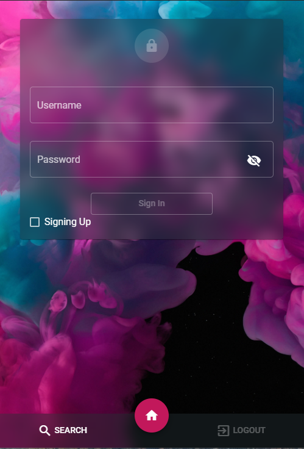

# Candidates

## Overview

Created as our final project for the "CS3754: Cloud Software Development" course
at Virginia Tech, this webapp was designed to reverse the typical dynamic
between recruiters and employees. This app allows recruiters to search for
candidates that meet their needs in terms of hard skills, and then contact them.
This way we can ensure that only pre-screened individuals are applying for
positions in which they actually have a chance of getting a job.

### Inverted Job Searching

The fundamental concept of our website is an easy place for recruiters to sort
through candidates. Recruiters can search for potential employees by the skills
they have - such as searching for someone with Angular and Nodejs experience, or
an even larger list skills a recruiter might want to filter applicants by. If
they fail to find an applicant with the skills they desire, the recruiter may
subscribe for email notifications - in which case, they will be emailed should
any new applicant join with the skills they searched by, or if a user on the
platform updates their skills.

## Implementation

This project was implemented using the Express.js framework for Node.js as a
backend, which serves static files built from our Angular front-end. In
addition, [Nodemailer](https://nodemailer.com/) was used to email recruiters.
Finally, [Mongoose](https://mongoosejs.com/) was used to access our Mongo
database, which has two collections - users and recruiters.

### Test it yourself [Node, Mongo required]

Simply download the repository and run app.js using Node. Navigate to
localhost/3030 to access the web page.

